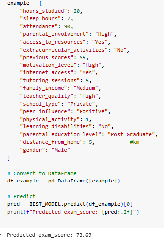

# Student Score Prediction (Machine Learning)

Predict students **Exam Score** from study habits and related factors using **Linear Regression** and **Polynomial Regression**.Includes clean EDA, preprocessing pipelines, model evaluation, feature subset experiments, and a saved, deployable pipeline.

Overview
--------

This project builds a regression model to estimate a student’s **exam\_score** based on study hours and other factors (sleep, attendance, participation, etc.).It’s designed for **Google Colab** with clean, modular code:

*   Data cleaning & EDA
    
*   Train/test split
    
*   **scikit-learn** pipelines (no leakage)
    
*   Baseline **Linear Regression**
    
*   **Polynomial Regression** (degree = 2) for comparison
    
*   Visualizations: distributions, correlations, predictions vs. actuals, residuals
    
*   Feature subset experiments
    
*   Model saving with **joblib**
    

Dataset
-------

Recommended: _Student Performance Factors_ (Kaggle).**Target column:** Exam\_Score (cleaned to exam\_score in the notebook)

**Example source columns:**

```Hours_Studied, Attendance, Parental_Involvement, Access_to_Resources,  Extracurricular_Activities, Sleep_Hours, Previous_Scores, Motivation_Level,  Internet_Access, Tutoring_Sessions, Family_Income, Teacher_Quality, School_Type,  Peer_Influence, Physical_Activity, Learning_Disabilities, Parental_Education_Level,  Distance_from_Home, Gender, Exam_Score```

> The notebook standardizes column names to lowercase with underscores (e.g., hours\_studied, sleep\_hours, exam\_score).

Project Structure
-----------------

```
   ├─ README.md  
   ├─ notebooks/
   │     └─ student_score_prediction.ipynb        # Main Colab notebook (end-to-end)
   ├─ models/
   │  └─ student_score_model.pkl               # Saved best pipeline (created by notebook)
   ├─ data/                                    
   │  └─ student_performance_factors.csv
   └─ requirements.txt                         # For local runs
 ```
**requirements.txt**

`   pandas  numpy  scikit-learn  matplotlib  seaborn  joblib   `

Features
--------

*   Robust preprocessing with ColumnTransformer
    
*   Numeric: median imputation → standard scaling
    
*   Categorical: most-frequent imputation → one-hot encoding (unknown-safe)
    
*   Baseline Linear Regression + Polynomial Regression (numeric only)
    
*   Metrics: MAE, MSE, RMSE, R²
    
*   Clean plots: histograms, heatmap, actual vs. predicted, residuals
    
*   Feature subset experiments (e.g., study-only vs. study+sleep)
    

Quick Start (Google Colab)
--------------------------

1.  Open notebooks/student_score_prediction.ipynb in Colab.
    
2.  from google.colab import drivedrive.mount('/content/drive')
    
3.  CSV_PATH = "/content/drive/MyDrive/ML_datasets/student_performance_factors.csv"TARGET = "Exam_Score" cleaned to "exam_score"
    
4.  Run all cells.
    
5.  The notebook will clean data, train models, compare performance, and save the best pipeline (e.g., /content/drive/MyDrive/ML_Models/student_score_model.pkl).
    

Local Setup (Optional)
----------------------

```
    git clone https://github.com//.git  
    cd   python -m venv .venv  # Windows: .venv\Scripts\activate  # macOS/Linux: source .venv/bin/activate  
    pip install -r requirements.txt
```

Place your CSV under data and update CSV_PATH in the notebook or a script.

Notebook Walkthrough
--------------------

*   **Setup & Config**: installs packages, sets random seeds, paths, target name.
    
*   **Load & Clean**:
    
    *   Standardizes column names (lowercase_with_underscores)
        
    *   Removes duplicates
        
    *   Attempts numeric coercion where appropriate
        
*   **EDA**:
    
    *   Missing values table
        
    *   Distributions/histograms of numeric features
        
    *   Correlation heatmap
        
    *   Key relationships (e.g., hours_studied vs exam_score)
        
*   **Split**:
    
    *   train_test_split with random_state=42
        
*   **Pipelines**:
    
    *   Numeric: impute → scale
        
    *   Categorical: impute → OneHotEncode
        
*   **Models**:
    
    *   Linear Regression (baseline)
        
    *   Polynomial Regression (degree=2, numeric only)
        
*   **Evaluation**:
    
    *   MAE, MSE, RMSE, R²
        
    *   Predicted vs. Actual scatter
        
    *   Residuals plot
        
*   **Experiments**:
    
    *   Feature subsets (e.g., study-only, study+sleep, study+sleep+attendance+parental_involvement)
        
*   **Save & Predict**:
    
    *   Saves best pipeline with joblib
        
    *   Predicts on a sample student dictionary
        

Modeling
--------

*   **Baseline**: LinearRegression
    
*   **Polynomial**: PolynomialFeatures(degree=2) on **numeric** columns only, then LinearRegression
    
*   **Pipelines**: prevent leakage by fitting preprocessing **only** on training data and ensure consistent inference.
    

**Metrics used**:MAE, MSE, RMSE, R² (+ 5-fold CV R²)

Experiments
-----------

Example subsets:

*   **Study only**: hours_studied
    
*   **Study + Sleep**: hours_studied, sleep_hours
    
*   **Study + Sleep + Attendance + Parental_Involvement**:hours_studied, sleep_hours, attendance, parental_involvement

Result
------
<div align="center">
  
